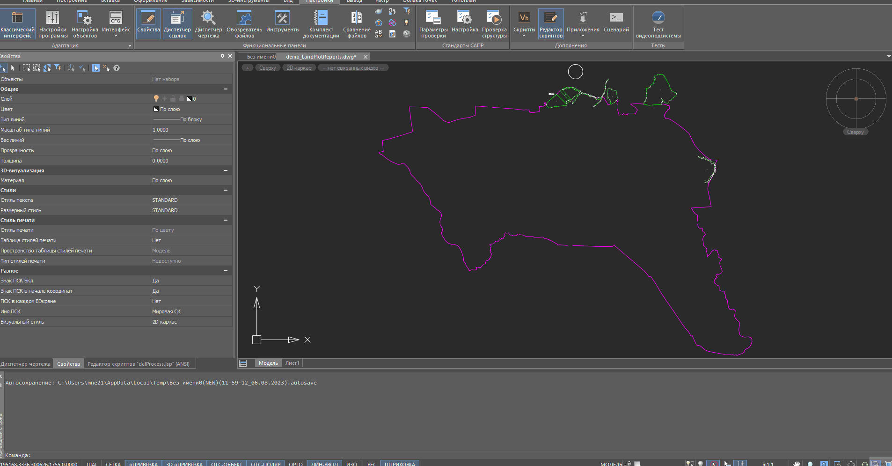

# LandPlotReport

### Ќазначение:
—оздание табличного отчета дл€ границы кадастровых участков(полилини€).

#### Ћогика работы:
1. ѕользователь указазывает границу/полилинию дл€ обработки.
2. ƒл€ каждой вершины скрипт находит текст/описание точки (по совпадению координат).
3. Ќаход€тс€ все кадастровые участки(блоки) по определенному свойству.
 (жестко прописано в коде).
4. ƒл€ каждой точки границы, производитс€ поиск совпадающих точек кадастровых участков.
(по полилини€м внутри блока, по точному совпадению координат).
5. —троитс€ отчет/таблица дл€ пользовател€.

#### ¬ажно:

1. Ѕеретс€ только первый текст/описание дл€ каждой вершины.
2. Ѕлоки кадастровых участков должны содержать свойство/описание поиска.

#### ѕример:

